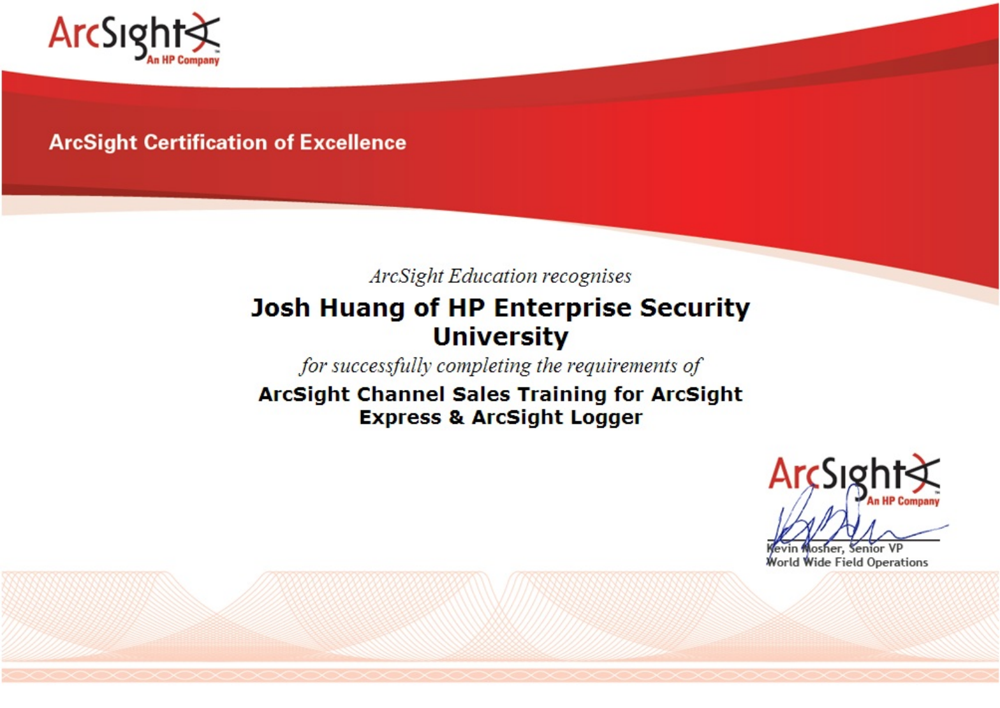
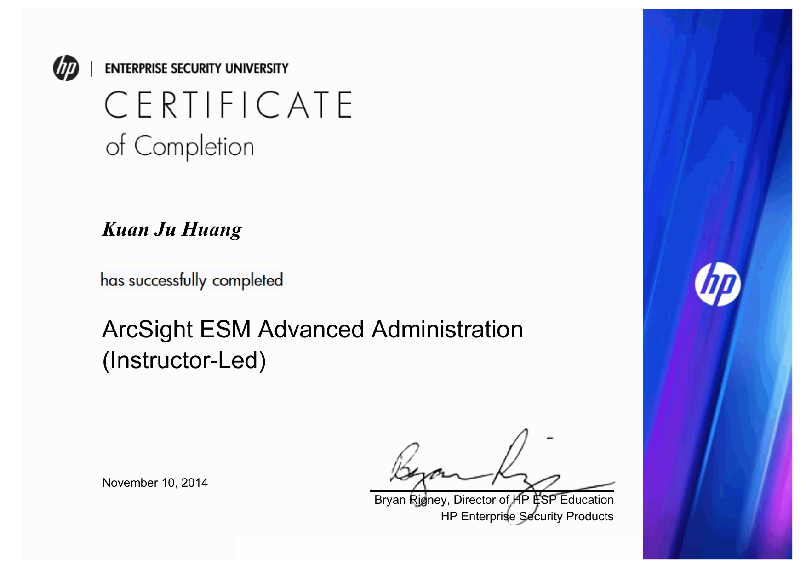
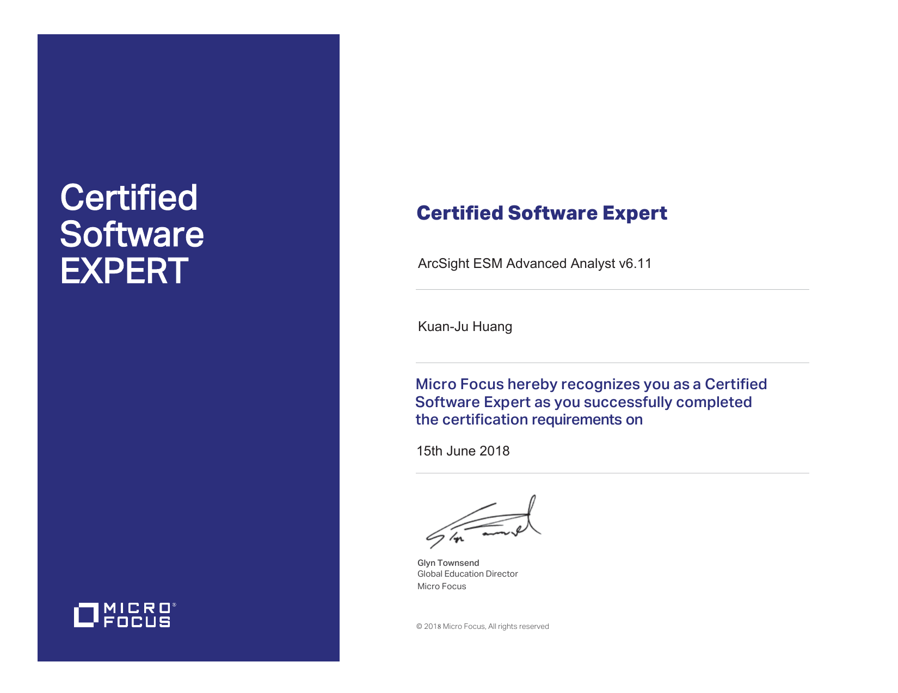
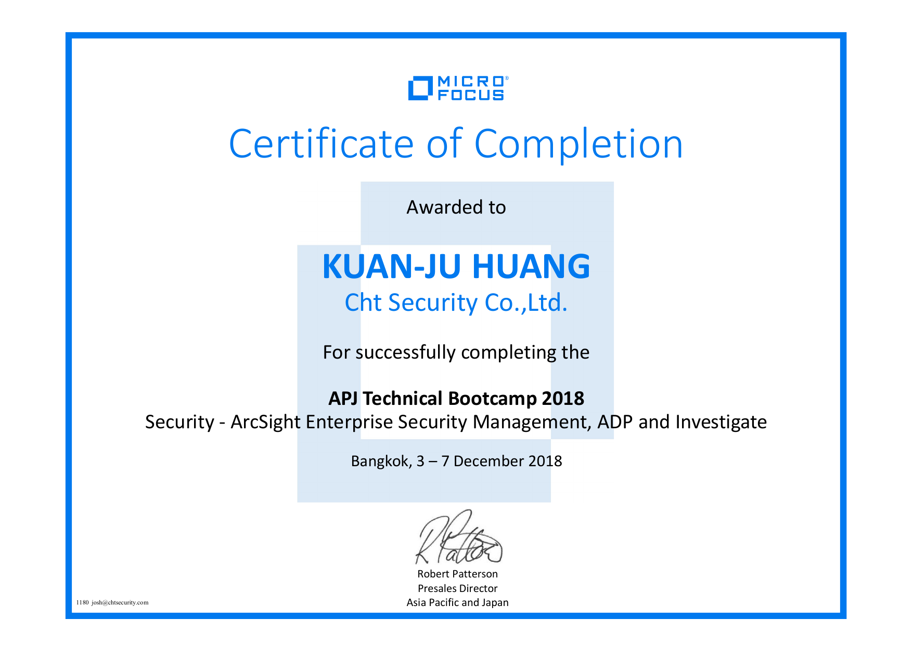
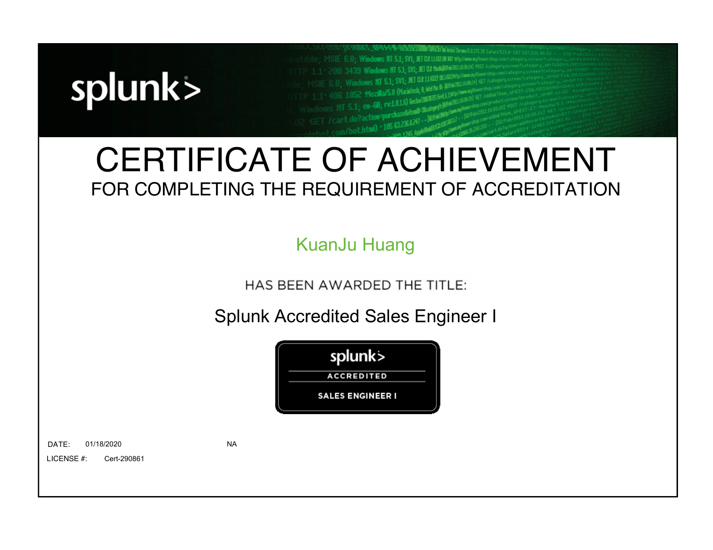
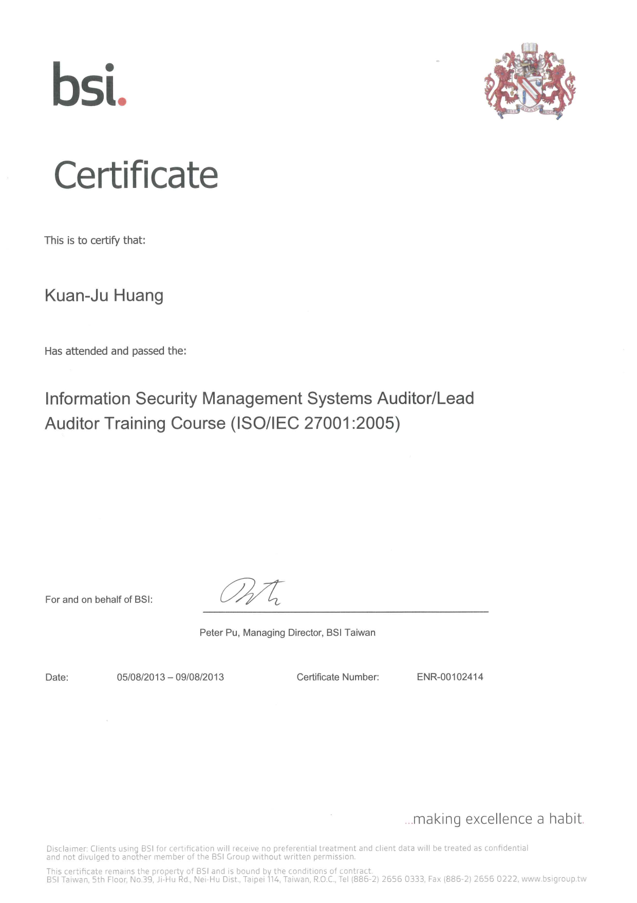
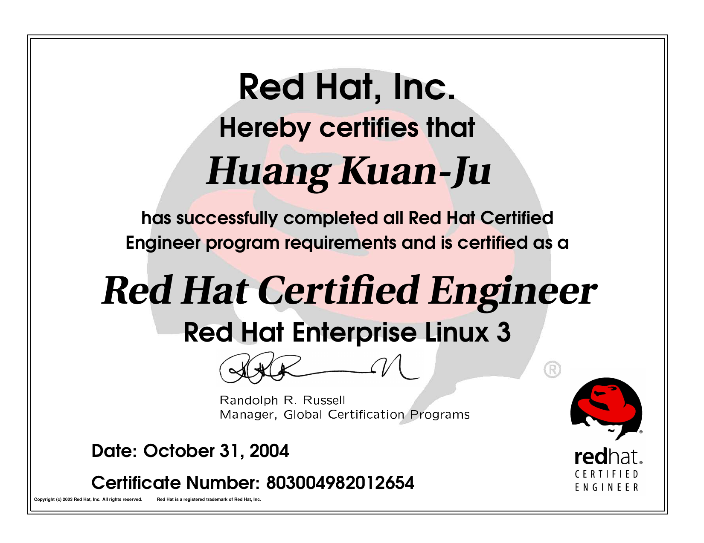
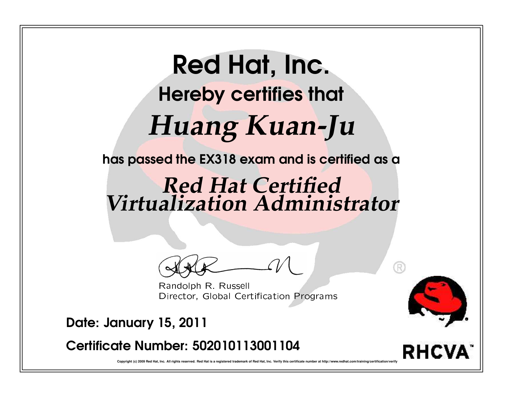

# Hi, I'm Josh Huang 👋

**Senior Cybersecurity Engineer | SIEM & SOC Operations Specialist** — Taipei, Taiwan

16+ years in cybersecurity, including 13 years within the Chunghwa Telecom group (Information Security Dept. → founding member of CHT Security). I've sat in **every seat of the ArcSight ecosystem** — end user, reseller presales/engineer, carrier partner solution presales, and MSSP SOC SIEM team manager — which means I understand SIEM problems from the vendor side, the delivery side, and the customer side at the same time.

Currently focused on **SIEM modernization and AI-assisted security operations**: migrating legacy ArcSight ESM deployments, building AI-driven SOC tooling, and running a self-hosted dual-SIEM lab to keep hands-on skills sharp.

## Selected projects

- **[CyberRange](https://github.com/huangalou/CyberRange)** — DetectOps harness: vendor-accurate log generation (53 catalog specs, 23 vendor lines) → SIEM ingestion (Wazuh / Elastic) → verified detection, with Time-to-Detect KPIs. Python engine + FastAPI + Next.js. Apache-2.0.

## 🔧 What I work on

- **SIEM Engineering** — ArcSight ESM / SmartConnectors / Logger, Splunk, Elastic Security, Wazuh; architecture & sizing, performance tuning, platform migration
- **Detection Engineering** — detection rule lifecycle, MITRE ATT&CK mapping, content packaging & QA tooling
- **SOC / MSSP Operations** — SOC build & operations, 24×7 monitoring process design, incident response, SOC training curriculum
- **AI-Assisted SecOps** — LLM-augmented detection triage, Claude Code–based automation workflows
- **OT / Critical Infrastructure Security** — IEC 62443, NIST SP 800-82, Purdue model / IDMZ; OT Zero Trust (white paper in progress)

## 📜 Certifications & vendor training

Vendor certifications span **three brand eras of the same product line — ArcSight (HP) → Micro Focus → OpenText** (click any certificate to view full size):

|  |  |  |  |
|:---:|:---:|:---:|:---:|
| ArcSight CoE — Channel Sales (ArcSight, an HP Company) | HP ESU — ESM Advanced Admin (2014) | **MF CSE — ESM Advanced Analyst v6.11** (2018) | MF APJ Bootcamp — ESM / ADP / Investigate (2018) |
|  |  |  |  |
| **Splunk Accredited SE I** (2020) | **ISO/IEC 27001 Lead Auditor Training** — BSI (2013) | **RHCE** — RHEL 3 (2004) | **RHCVA** — EX318 (2011) |

- **Micro Focus Certified Software Expert — ArcSight ESM Advanced Analyst v6.11** (2018)
- Micro Focus APJ Technical Bootcamp — ArcSight ESM / ADP / Investigate (Bangkok, 2018)
- HP Enterprise Security University — ArcSight ESM Advanced Administration, instructor-led (2014)
- ArcSight Certification of Excellence — Channel Sales Training: ArcSight Express & Logger (ArcSight, an HP Company era)
- **Splunk Accredited Sales Engineer I** (2020)
- **ISO/IEC 27001 ISMS Auditor/Lead Auditor Training** — BSI (2013)
- **Red Hat Certified Engineer (RHCE)** — RHEL 3 (2004)
- **Red Hat Certified Virtualization Administrator (RHCVA)** — EX318 (2011)

## 📫 Contact

- 📧 alou@joshhuang.tw / alou.huang@gmail.com
- 🔗 [linkedin.com/in/josh-huang](https://linkedin.com/in/josh-huang)
